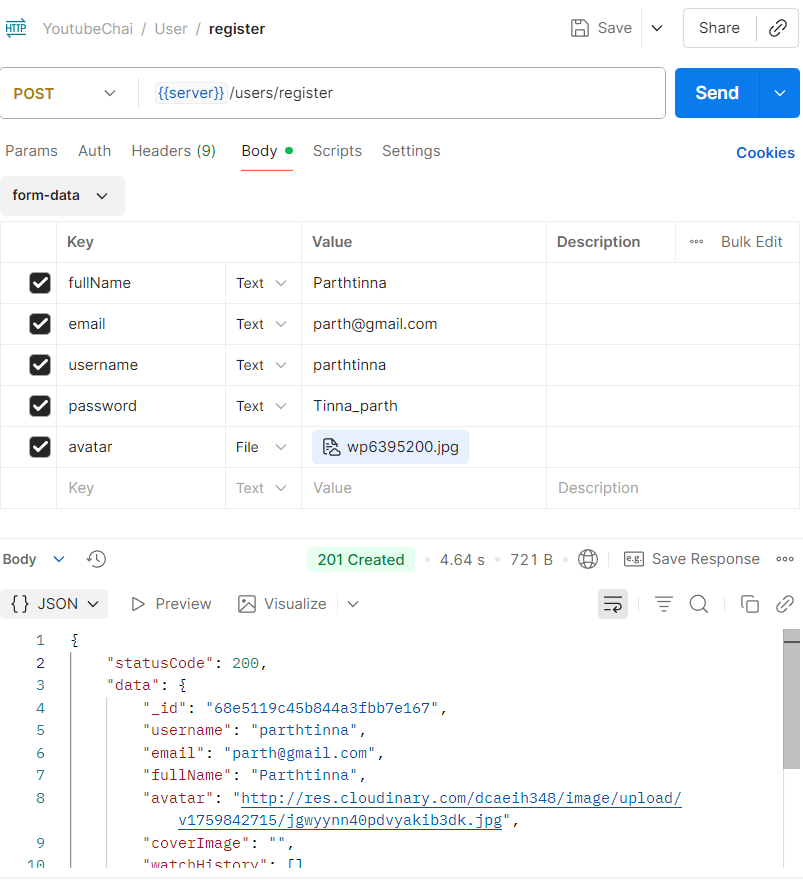
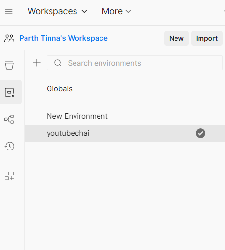
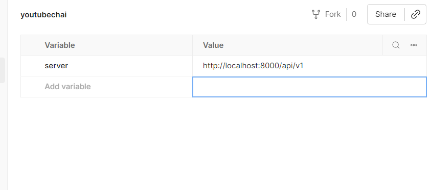

# Backend Learning
Now going to start backend from Chai aur Code. with javascript

-[MODEL LINK](https://app.eraser.io/workspace/YtPqZ1VogxGy1jzIDkzj)

<strong >Packages Used</strong>

```
npm i express
npm i cookie-parser
npm i cors
npm i dotenv
npm i mongoose
npm i mongoose-aggregate-paginate-v2
npm i jsonwebtoken
npm i cloudinary
npm i multer
```

##  Day 1 (Setup of Backend)

``` html
1. Installed dev dependies 

 *nodemon : which just refresh the project on saving changes on run time. (command : npm i -D nodemon)

*prettier : which make our project scalable for long period of time. (command : npm i -D prettier)
(for formatting purpose and common standardization)
```
### Basic commands for setup :
1.  <span style= "color: green"> npm i -D nodemon </span>
2.  <span style= "color: green"> npm i -D prettier </span>

## Project Directory structure created
```
node_modules/
public/
└── temp/
    └── .gitkeep

src/
├── controllers/
├── Db/
├── middlewares/
├── models/
├── routes/
├── utils/
├── app.js
├── constans.js
└── index.js

.env
.env.sample
.gitignore
.prettierignore
.prettierrc
package-lock.json
package.json
Readme.md
```
Note :  Here we just creted the project directory structure. 
1. we are using '.gitignore' file to not upload important files on github.
2. also using '.prettierignore' file to not change the format of specific files. 

## Packages installed

1. <span style= "color: green"> npm i mongoose </span>
2. <span style= "color: green"> npm i express </span>
3. <span style= "color: green"> npm i dotenv </span>

## Day 2 (Connected MongoDb database )
```
today I learn about how to connect mongoDb data base. for that I use Online data base
```
here is the database site : [Monogo Db Database](https://cloud.mongodb.com/v2/68db99859b00603e6abeb0eb#/clusters)
### Steps for connecting Data Base
```
Note: I used free shared plan
```
```
1. need to create account on 'MongoDbAtlas' site
2. create a project 
3. Add new Database access
4. Add new Network access.
5. in cluster/database section click connect and copy that connection string ( we use compass)
```
```
connection string : mongodb+srv://Parth:<db_password>@cluster0.jrnfayp.mongodb.net/
```
```
use this above connection string in your Application to connect to data base 
```

```javascript 
const connectDB = async () => {
  try {
    const connectionInstance = await mongoose.connect(
      `${process.env.MONGODB_URI}/${DB_NAME}`
    );
    console.log(`\n MongoDB connected !! DB HOST: ${connectionInstance}`);
  } catch (error) {
    console.log("MONGODB Connection error");
    process.exit(1);
  }
};
export connectDB;
```
## Day 3 (Making Utilities and Adding more packages)
```
Note for Day 3 : Today I just created the classes ApiError , ApiResponse, ayncHandler (Higher order function ) which is I am going to user to standardize the Api errors, Responses . so In case if i get errors it will be easier for me to resolve.
```
### Packages
1. <span style="color:green">npm i cors</span>
2. <span style="color:green">npm i cookie-parser</span>

## Work I have done today 
```
1.  Today I Created Utilities to handle Api Response and Api Eroor Response
```
```
2.  Added aynchandler for routes controllers which enforse Promise.
```

3.  Added Configrations in app.js 

``` javascript
app.use(Cors({
    origin: process.env.CORS_ORIGIN,
    credentials: true
}))
// configrations. 
app.use(express.json({limit:"16kb"})) // used to set 
app.use(express.urlencoded({extended:true,limit:"16kb"}))
app.use(express.static("public"))
app.use(cookieParser())
```
## Day 4 (User Model and Video Model)
```
Today i created user and video models .
```
## Work I have done today
UserModel: 

1.<strong> Created user Model</strong>

2.<strong> Added Two packages </strong>
```javascript
  import jwt from "jsonwebtoken";
  import bcrypt from "bcrypt"
```

3.<strong>Learn about Middlewares (HOOKS).</strong>
```
Middleware is like a middle layer (a bridge) between an incoming request/action and the final response/result.
```

```javascript
userSchema.pre("save",async function(next){
    if(!this.isModified("password")) return next();

    this.password = bcrypt.hash(this.password,10)
    next()
})
```
```
In our case that pre(): is middleware we used,Accepts two arguments ("event",callbackfunction) 

callbackfunction : accepts next() as argument to call next middleware or passing the control.

Examples(event): "save", "validate", "remove", "find", "findOne", "updateOne", "aggregate",
``` 
4.<strong> Defining Schema methods:</strong>
```javascript
userSchema.methods.isPasswordCorrect = async function(password){
   return await bcrypt.compare(password,this.password)
}// adding function.
```

```javascript
userSchema.methods.generateRefreshToken = function(){
     jwt.sign({
        _id: this._id,
    },
process.env.REFRESH_TOKEN_SECRET,{
    expiresIn: process.env.REFRESH_TOKEN_EXPIRY
})
}
```
here we have added function with schema to clean the code.

5.<strong> JWT tokens ( jason web tokens )</strong>

these are bearer token we are going to use in our code.
```
JWT is a compact, URL-safe token used for authentication and authorization.

Think of it as a digital ID card for your users.
```
Structure of jwt :
```
header.payload.signature
```
Used in Our code: (user.model)
```javascript
userSchema.methods.generateAccessToken = function(){
    jwt.sign({
        _id: this._id,
        email: this.email,
        username: this.username,
        fullname : this.fullName
    },
process.env.ACCESS_TOKEN_SECRET,{
    expiresIn: process.env.ACCESS_TOKEN_EXPIRY
})
}
```
```
jwt.sign() :  this function is used to create the token which accepts  three arguments 

1. {object}: object on data which we going to pass in our token .
2. SecretKey : this key is used to encrypt the data ( this is wriiten by us)
3. Token Expiry : this will set the expiry time of the token .
```
6.<strong>Learn about Bcrypt</strong>
```
We Use bcrypt for the hashing password. basically used enscrypt the password. 
```
```javascript
userSchema.pre("save",async function(next){
    if(!this.isModified("password")) return next();

    this.password = bcrypt.hash(this.password,10)
    next()
})
```
we can bcrypt with middle ware, before inserting password in the data base we are encrypting the password.

7.<strong>Learn about plugIn</strong>
```
A plugin is like an add-on or extension that you can attach to your schema to add extra functionality without writing all the code yourself.

Think of it as pre-built code you “plug in” to your schema to get new features.
```

```javascript 

videoSchema.plugin(mongooseAggregatePaginate)
```
Plugin we used in out code to add exptra functionality of paging videos.


## Day 5 ( Learning about cloudinary and fie upload)
```
Note : I used cloudinary for the File upload 
```
[Cloudinary link](https://console.cloudinary.com/app/c-df05e38ef739e5550ee043869d3799/home/dashboard)

this is the cloud service I am  going to use in our backend for the file upload (I am using free plan)

## Work I have done today.

```
So the basic user Scenario : we are taking file from the user (by using multer) and temporary save this file/image to our local server and immidiately upload this file to the cloud (by using cloudinary)
```
1.<strong> learn about Cloudinary </strong>
```
for using the cloudianry we need to add the package to our project(backend ) 
```
npm install cloudinary 
```
need to add the configrations of cloudinary to use the services like : 
```
```
(apikey , cloud_name, api_secret.)
```
Code we used in our cloudinaryUtility :
```javascript
cloudinary.config({
    cloud_name: process.env.CLOUDINARY_CLOUD_NAME,
    api_key: process.env.CLOUDINARY_API_KEY,
    api_secret: process.env.CLOUDINARY_API_SECRET
})
```
these are the conigrations need to use the cloudinary.

2.<strong>learn about multer</strong>
```
Multer is a Node.js middleware for handling file uploads basically used with (express.js)
```
```
I use multer as a middle ware. the basic work of multer is to take files from the frontend. 
```
BASIC CODE WE USED

```javascript
import multer from "multer";

const storage = multer.diskStorage({
  destination: function (req, file, cb) {
    cb(null, "../pulbic/temp")
  },
  filename: function (req, file, cb) {
    cb(null, file.originalname)
  }
})
export const upload = multer({ storage})
```
This code will tell the multer where to save the file and we can also perfom changes in file name before saving as for saving unique file name. 

### Package Used 

1. <span style ="color:green">npm i multer</span>
2. <span style ="color:green">npm i cloudinary </span>


3.<Strong>Learn about FileSystem (fs)</strong>

this library we are going to handle the file system 
all the function regarding files
```
1. Read 
2. write 
```
<h2 style= "color:yellow; text-align= center">Today our setup is finally completed </h2>


## Day 6 ( Learning about Htpp)


## Day 7 (Learning about Controllers And Routes)

```
today I learn about the concept of Controllers in backend , controllers are methods written for every api end point which handles some kinds of operation.
```
```
In our code we are not using controllers directly we are using middle ware and routing to send control to controllers 
```

## How I am using Controllers

1. <strong>  First Step</strong>
```
here we Created the 'User.controller.js' seprate file and exporting the function 'registeruser. 
```
```javascript
import { asyncHandler } from "../utils/asyncHandler.js";
const registerUser = asyncHandler(async (req,res)=>{
     res.status(200).json({
        message: "User Registered"
    })
})
export {registerUser}
```
2. <strong>Second Step</strong>

```
here we difine the routes of the controller in 'User.routes.js' for the redirecting control to the 'user.contorller.js'
```
```javascript
// all routing. of users
import { Router } from "express";
import { registeruser } from "../controllers/user.controller.js";

const router = Router()


router.route('/register').post(registeruser)


export default router
```
3. <strong>Third Step</strong>
```
here we Imported the route and declare it for which route to redirect 
```
```javascript
// routes import 
import userRouter from './routes/user.routes.js'

// routes declaration
app.use("/api/v1/users",userRouter)

```
#
<strong>Flow</strong>

```
/api/v1/users --> userRouter(/register) --> registerUser(user.controller)
```
* end point willl be 
```
/api/v1/users/register : this will call the Register user function.
```

## How I am using Routes
1. First need to import the Router
```javascript
//Importing
import { Router } from "express";
```
2. Second need to start the Router as same as react.
```javascript
const router = Router()
```
3. Third just need to use that this for routing with route() method 
```javascript
router.route('/register').post(registerUser)
```
#
# Day 8 (Registring User)
```
Today we Register the user to our MongoDB(atlas) cloud data base and handled Avatar images and later uploaded this image on the cloudinary.

Right now I used 'Postman' tool for testing the Api
```
```
Note: All the Registration code is written in Single controller 'userRegistration'
```
Here are steps for registring user:
```
1. first need to get data from the user.
2. need to validate the data. 
3. Check if user already exist: username, email
4. check for images, check for avatar
5. upload them to cloudinary, avatar
6. create user object - create entry in db 
7. remove password and refresh token field from response.
8. Check for user creation 
9. return response of success.
```

1.<strong> Getting Data form the User </strong>
```
I used  Postman for sending the data from front end.
```
2.<strong>For Validating :</strong>
```javascript
if(
      [fullName,email,username,password].some((field)=>
    field?.trim() ==="")
  )
{
    throw new ApiError(400,"All fields are required");
}
```
3.<strong > Checking User Already Exist</strong>
```javascript
// checking if user already exist using the model
const existedUser = await User.findOne({
    $or:[{ username }, { email }]
})
    if(existedUser){
        throw new ApiError(409,"User already Exists")
    }
  ```
4.<strong>Checking for images and avatar </strong>
```javascript
const avatarLocalPath = req.files?.avatar?.[0]?.path;
const coverImageLocalPath = req.files?.coverImage?.[0]?.path;
  if(!avatarLocalPath){
    throw new ApiError(400,"Avatar file is required.")
  }
  ```
  ```
  Note:  this 'req.files' only work if you are using middleware 'upload.fields()'

  if you have written 'upload.single()' than you can access this using 'req.file' (singular).

  In our case we are using upload.fiels() and we have inject it before routing to Regiter controller.
  ```
  ```javascript
  // code we Used 
  
router.route('/register').post(
  upload.fields([
    {
        name:"avatar",
        maxCount: 1
    },
    {
        name: "coverImage",
        maxCount:1
    }
  ]),
    registerUser
)
  ```
  5.<strong>Uploading the image to Cloudinary</strong>
  ```javascript
  const avatar = await uploadOnCloudinary(avatarLocalPath)
const coverImage = await uploadOnCloudinary(coverImageLocalPath)

if(!avatar){
    throw new ApiError(500,"Something went wrong, File is not uploaded.")
}
  ```
  ```
  Note : For uploading the files on the cloudinary we have created the utility. 
  so that need not to write every time.
  ```
  ```javascript
  // here is Utility we used 
  const uploadOnCloudinary = async(localFilePath)=>{
    try {
        if(!localFilePath) return null
        // upload file on Cloudinary 
     const response =  await  cloudinary.uploader.upload(localFilePath,{// for uploading to cloudinary
            resource_type:"auto"
        })
        // file has been uploaded successfull
        console.log("File is uploaded on cloudinary ",response.url);
        return response //
        
    } catch (error) {
        fs.unlinkSync(localFilePath)// remove the Locally saved temporary file as the upload operation got failed.
        return null;
    }
}
```
6.<strong>create user object - create entry in db</strong>
```javascript
const user = await User.create({
    fullName,
    avatar:avatar.url,
    coverImage:coverImage?.url || "",
    email,
    password,
    username: username.toLowerCase()
})
```
```
Note : create() method is inbuild binded with our model(User)
```
7.<strong> Remove password and refresh token field from response.</strong>
```javascript
const createduser = await User.findById(user._id).select(
    "-password -refreshToken" 
)
```
```
Note : this 'select()' syntax is diffrent as it takes argumnents in string and used to remove the fields , for removing the field need to write the name of the field with the negative symbol and space between fields name is required.
```
8.<strong> Check for user creation</strong>
```javascript
if(!createduser){
    throw new ApiError(500,"Somthing went wrong while registering the user")
}
```
9.<strong> Return response of success.</strong>
```javascript
return res.status(201).json(
    new ApiResponse(200,createduser,"User Registered Successfully")
)
```
# Day 9 ( Testing the api Using PostMan) & (Debug)
```
Note : For Debugging the code i used console log of response and request , for checking the response is comming or not.
```
```
Today I learn about how to Test the Api's using the POSTMAN , and also learn how to debug the code by checking erros.
```
## here are some req: console outputs from which i Learn and check what are values in req.
#
<h3>1 Testing of 'req.body'</h3>

```javascript
console.log("req.body Testing: ",req.body);// for Testing 
const {fullName,email,username,password}=req.body
```
Output of Testing on console :
```
req.body Testing:  [Object: null prototype] {
  fullName: 'Parthtinna',
  email: 'parth@gmail.com',
  username: 'parthtinna',
  password: 'Tinna_parth'
}
```
#
<h3>2. Testing the cloudinary Response </h3>

```javascript
 const response =  await  cloudinary.uploader.upload(localFilePath,{// for uploading to cloudinary
            resource_type:"auto"
        })
        // file has been uploaded successfull
        console.log("File is uploaded on cloudinary ",response);
```
Output of tesiting on  the console:
```
File is uploaded on cloudinary  {
  asset_id: 'a8990629597e6e3d562547e29b42d68b',
  public_id: 'jgwyynn40pdvyakib3dk',
  version: 1759842715,
  version_id: '6ef3ede6e1bd9e463bdac852e61d45f2',
  signature: 'f1b10c85b93ccf0dd67d7c75bf59f8516083e3ba',
  width: 1920,
  height: 1080,
  format: 'jpg',
  resource_type: 'image',
  created_at: '2025-10-07T13:11:55Z',
  tags: [],
  bytes: 326749,
  type: 'upload',
  etag: '2324e3d856b7e29c138ab8b4901af472',
  placeholder: false,
  url: 'http://res.cloudinary.com/dcaeih348/image/upload/v1759842715/jgwyynn40pdvyakib3dk.jpg',
  secure_url: 'https://res.cloudinary.com/dcaeih348/image/upload/v1759842715/jgwyynn40pdvyakib3dk.jpg',
  asset_folder: '',
  display_name: 'jgwyynn40pdvyakib3dk',
  original_filename: 'wp6395200',
  api_key: '429415225295416'
}
```
<h3>3. Testing the User Created response</h3>

```javascript

const user = await User.create({
    fullName,
    avatar:avatar.url,
    coverImage:coverImage?.url || "",
    email,
    password,
    username: username.toLowerCase()
})

// ********************************SELECT TO REMOVE FIELDS *****************************************
const createduser = await User.findById(user._id).select(
    "-password -refreshToken" 
)
console.log(createduser);
```
Output of testing On the console.
```
{
  _id: new ObjectId('68e5119c45b844a3fbb7e167'),
  username: 'parthtinna',
  email: 'parth@gmail.com',
  fullName: 'Parthtinna',
  avatar: 'http://res.cloudinary.com/dcaeih348/image/upload/v1759842715/jgwyynn40pdvyakib3dk.jpg',
  coverImage: '',
  watchHistory: [],
  createdAt: 2025-10-07T13:11:56.520Z,
  updatedAt: 2025-10-07T13:11:56.520Z,
  __v: 0
}
```
## From the Postman 
```
From the postman I send data through 'form-data' as and also Create the collection and set the Environment variable for my ease and also using industury standards.
```
1. Created my Own collection


2. Register Api Testing and sending data 

3. Created my own Environment 

4. Setting the varible inside environment.


<strong>From now I will be testing all api's in my collection</strong>
#
## Good Practices..
```
1. Always write code of data base in 'try - catch '
2. Your database is in another continent always use 'Async- await'
3. app.use() is most of the time used in middlewares.
4. async function () always return promise. need to handle that for good practice.
5. Use middleware for the Routing user to the controllers.
6. for testing your api You need to check the response using 'console.log()
```

# Note for errors 
```
1. In the import section write the complete name of the file with extension other wise it will throw error. ( only naming the directory will now work)
```
<strong>for eg : </strong>

### this will throw error
```javascript
import { DB_NAME } from "../constants";
```
### this will not throw error
```javascript
import { DB_NAME } from "../constants.js";
```

#
#
```
2. Always need to return function for higher order function.
```
<strong>for eg : </strong>

### this will Not Work
```javascript
const asyncHandler= (requestHandler)=>{
    (req,res,next)=>{ 
       Promise.resolve(requestHandler(req,res,next))
        .catch((err) => next(err))
    }
}
```
### this will work
```javascript
const asyncHandler= (requestHandler)=>{
   return (req,res,next)=>{ // return is necessary for making it higher order function.
        Promise.resolve(requestHandler(req,res,next))
        .catch((err) => next(err))
    }
}
```
<strong>Why not Work :</strong> Because that function we are creating is higher order function which means it expect a call back function.